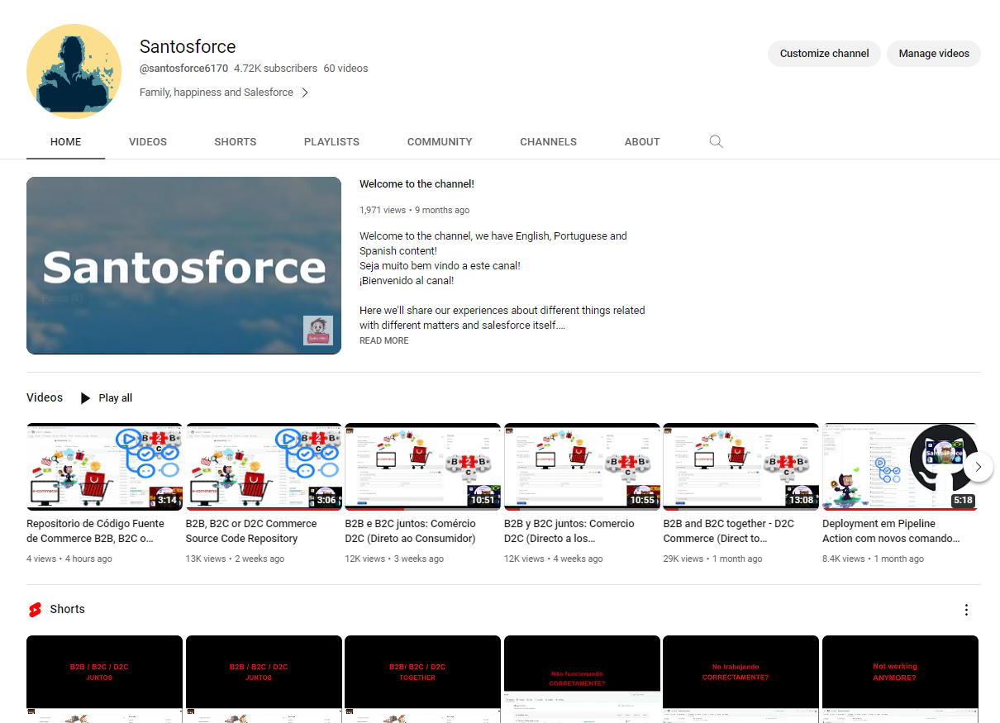
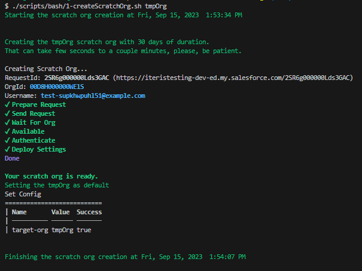
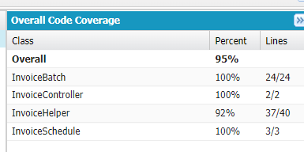
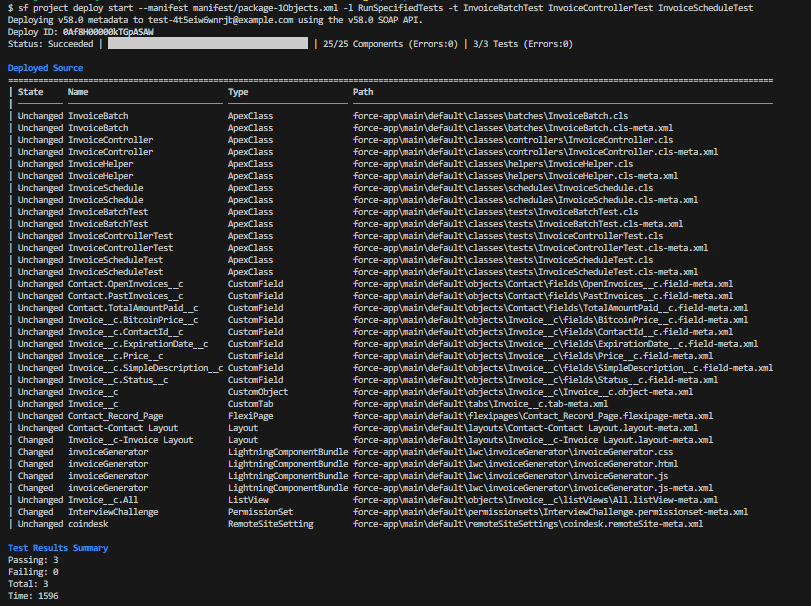
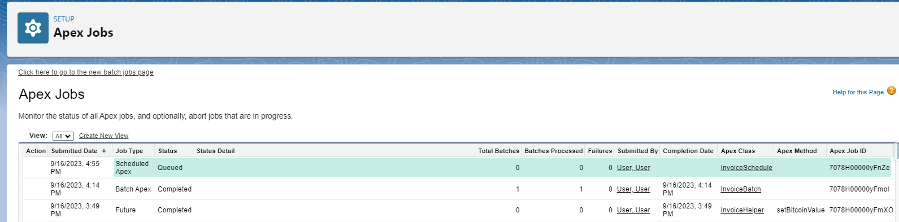

# Hire me to your projects

Ok, I know that sounds a little bit weird, but I think we can do good deals together!

This README file is just supposed to help you to understand me a little bit more, seeing some things I'm able to do!

What is supposed to show you here?

* Salesforce CLI knowledge;
    * Deployments and validations;
    * Metadata manipulation;
    * Data manipulation;
    * Permission assignment;
* Salesforce knowledge;
    * Lightning Data Service;
    * Lightning Design System;
    * Lightning Web Components;
    * Apex classes and different utilizations;
* Bash script knowledge;
* Simple documentation approach;
* etc;

And that, is supposed to work with simple steps, like counting from 1 to 5:

1. Create the scratch org environment;
1. Create the background application;
1. Import initial data;
1. Ensure the code coverage and production deployment (whenever needed);
1. Put a job to run;

I'm serious, the **steps are described in the next sections**.

Want to see more cool things besides that?
Take a look in my youtube channel!

!

So, let's step by step get this project running...

## 01 - Scratch org creation

To make our lives easy, we can automate many things, putting the Salesforce CLI, and the bash scripts to run together!

    ./scripts/bash/1-createScratchOrg.sh tmpOrg

## 02 - Custom fields and permissions

I'm using a custom Invoice object here.
To create the necessary things and have access on that, just execute the command below:

    sf project deploy start --ignore-conflicts --manifest manifest/package.xml

After that, let's give the permissions:

    sfdx force:user:permset:assign --perm-set-name InterviewChallenge --target-org tmpOrg

## 03 - Create initial data

At this point, we could just use the create record command:

    sf data create record --sobject Account --values "Name='Some Account Name' Website=www.example.com"

But just to show you a little bit about the data tree importation, let's do it in another way instead:

    sf data import tree --files scripts/json/Account-Contact.json 

## 04  - Coverage
All of it is very important, but in the end of the day, you will not be able apply on your productive environment, if the coverage is not enough!

Here you'll have this [Apex Test Suite](force-app/main/default/testSuites/TestAllTogether.testSuite-meta.xml) to easily get sure about that!

So, you can really check if the things are running as supposed to be:

    sf project deploy start --manifest manifest/package.xml -l RunSpecifiedTests -t InvoiceBatchTest InvoiceControllerTest InvoiceScheduleTest

## 05 - Let the job running

Well, if everything was executed fine until here, you can schedule the job

    sf apex run --file scripts/apex/invoiceScheduler.apex

